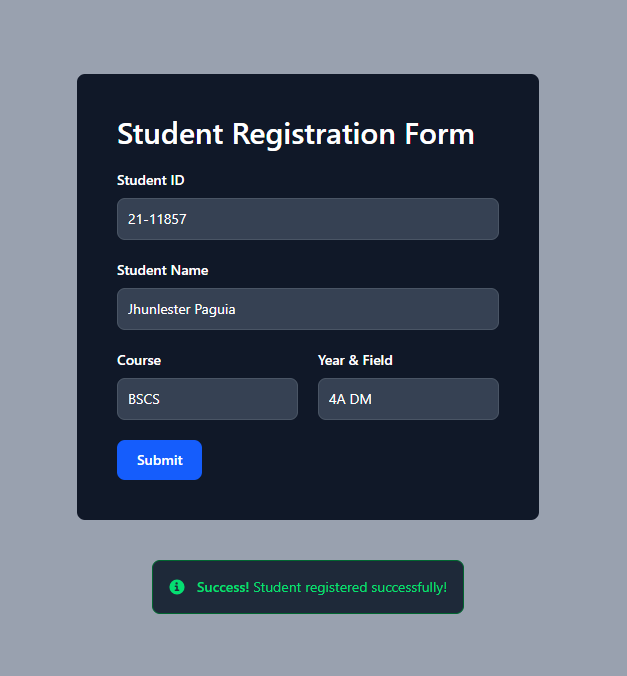
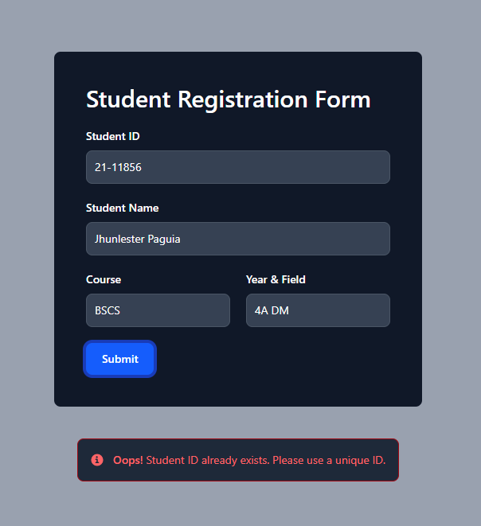
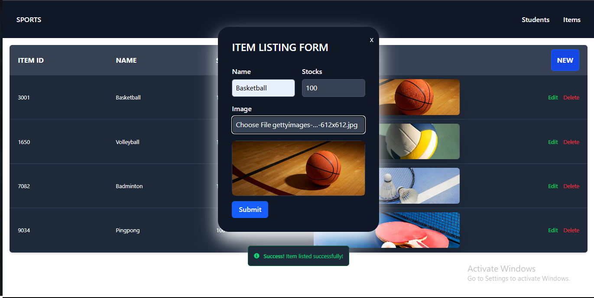
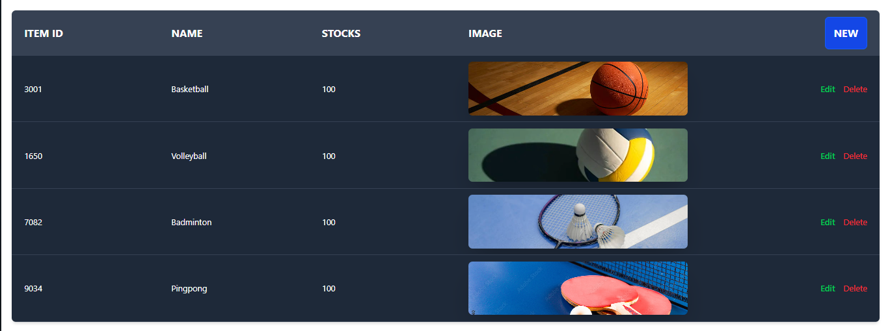

# Item Borrowing

A fullstack web development project allowing admin to track the borrowing history in the inventory without using the traditional paper listing of names that is more vulnerable.

## Student Registration
 

  
  

## Listing Items and Populating Table

  
  

## To Be Updated Soon

Finally Added a table for items, successfully added new items, will now proceed to remove items in the table. I'll call it a day.

Next Task is to remove an item in the table or the record