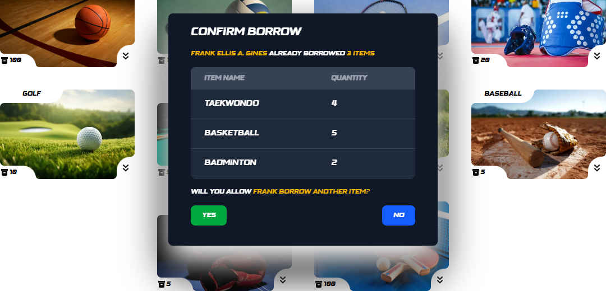
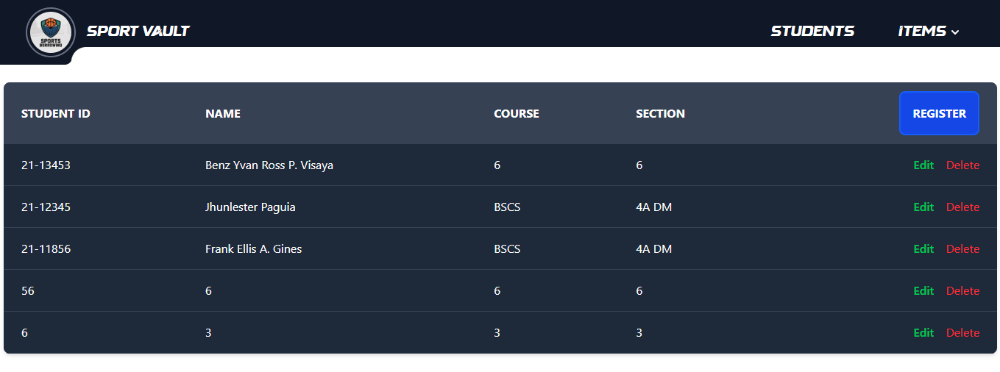
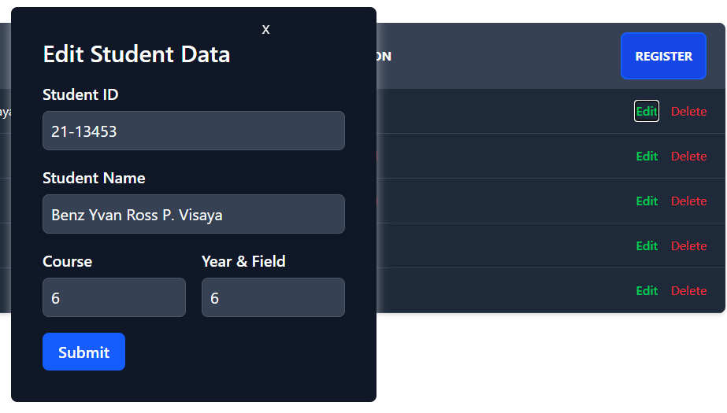
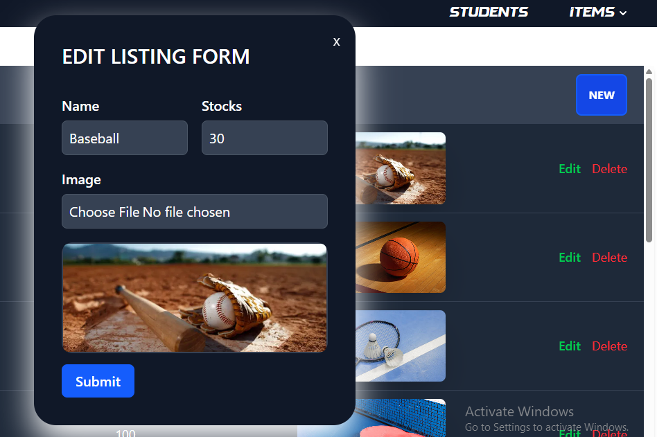
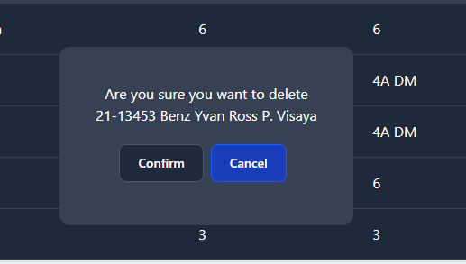

# SPORT VAULT

A fullstack web development project allowing admin to track the borrowing history in the inventory without using the traditional paper listing of names that is more vulnerable.

## Borrow Item

Click an item you want to borrow in the menu then insert student id and quantity of the items to be borrowed.
If the student already borrowed and item then we will ask

   
  

## Student Registration and Table
 

  
  
  

## Item Listing and Table

   
  

## Edit Student and Item Data

   
  

## Remove Student and Item Data

   
  

## To Be Updated Soon

Next Showing pop up message like a modal on the right side for notifying user for success or error operations and also ui sucks on adding and editing data